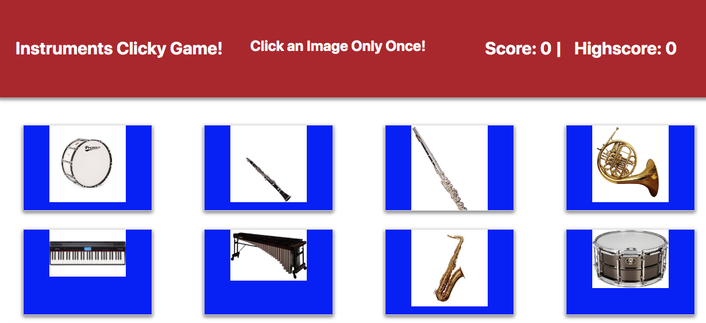

## React-Clicky-Game Instruments.

### This game is set up with 10 images of instruments. The goal is to click an image without clicking the same image twice. If you click all images without duplicating, you win! If you click an image twice you lose and have to start over. 

### Worf Breaking Things

This particular section is about Worf cloning the repo locally and then fucking everything up in a separate branch to see if the branch will push to the remote. Berta berta and cheeselets, flam drag fighter pilot stuff. 

### Technology Used.

This application uses React to handle all front-end features.

### Notes

My first React project created in bootcamp class.

### Demo

Click here: https://jrmiller022.github.io/react-clicky-game

